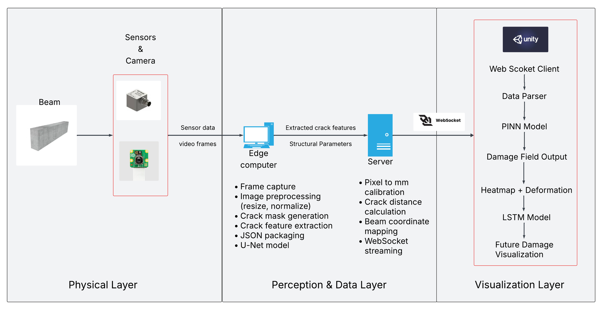
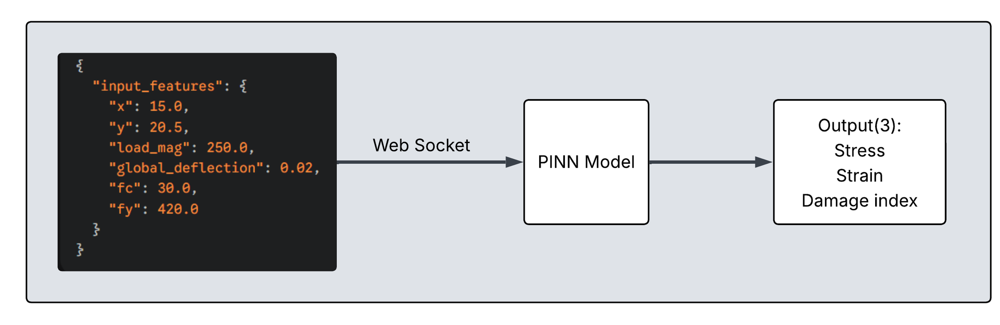
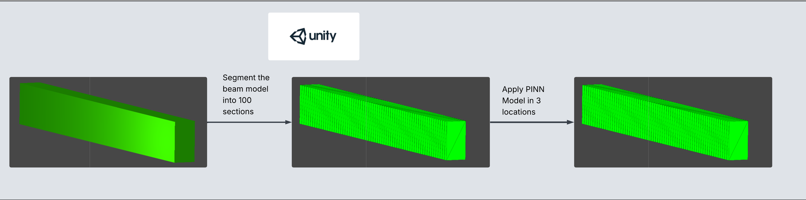
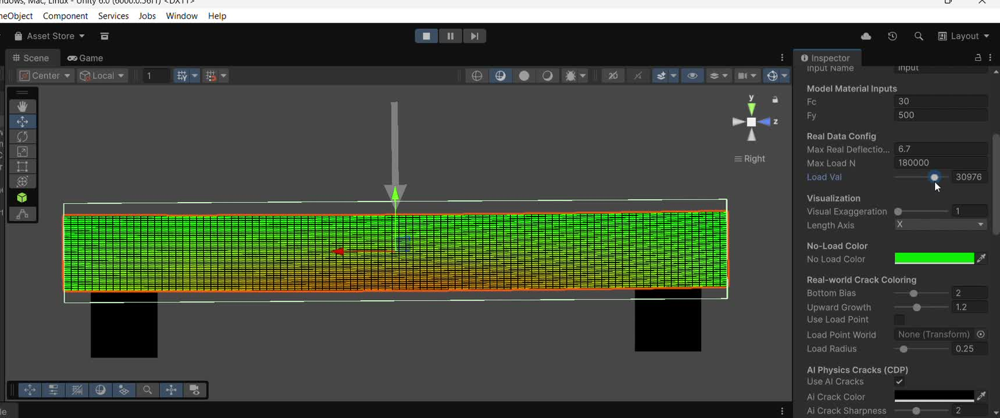
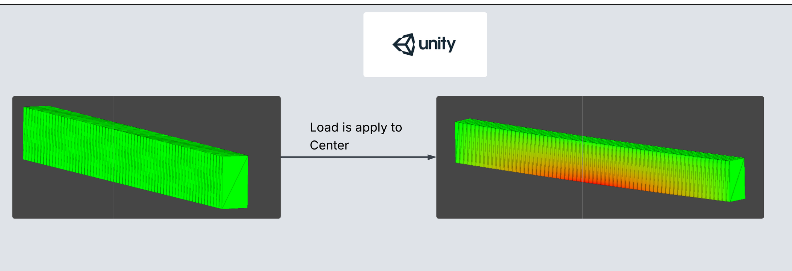
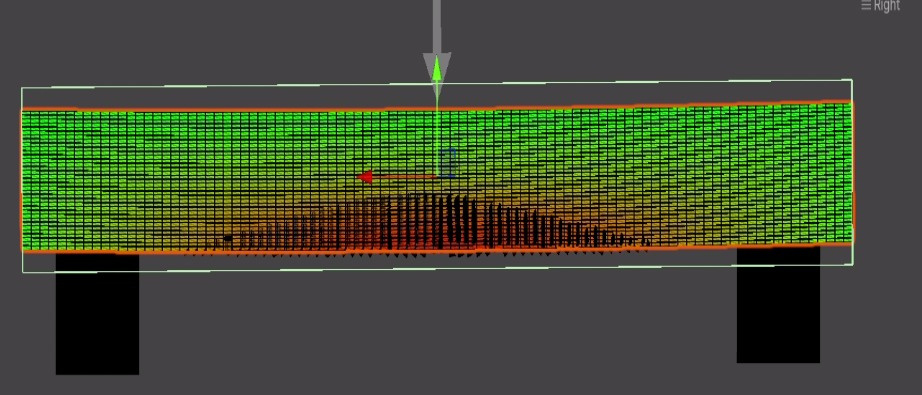
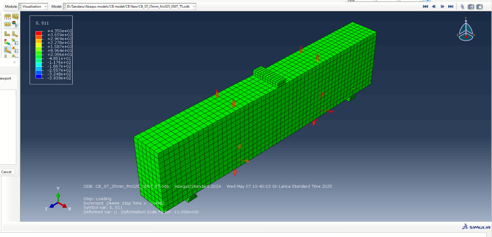

[comment]: # "This is the standard layout for the project, but you can clean this and use your own template"

# AI Enabled Digital Twin for Crack Evolution in Concrete Beams

#### Team

- e20016, Amarakeerthi H.K.K.G., [e20016@eng.pdn.ac.lk](mailto:e20016@eng.pdn.ac.lk)
- e20231, Madhura T.W.K.J., [e20231@eng.pdn.ac.lk](mailto:e20231@eng.pdn.ac.lk)
- e20404, Ukwaththa U.A.N.T., [e20404@eng.pdn.ac.lk](mailto:e20404@eng.pdn.ac.lk)

#### Supervisors

- Dr. Upul Jayasinghe, [upuljm@eng.pdn.ac.lk](mailto:upuljm@eng.pdn.ac.lk)
- Dr. J.A.S.C. Jayasinghe, [supunj@eng.pdn.ac.lk](mailto:supunj@eng.pdn.ac.lk)

#### Table of content

1. [Abstract](#abstract)
2. [Related works](#related-works)
3. [Methodology](#methodology)
4. [Experiment Setup and Implementation](#experiment-setup-and-implementation)
5. [Results and Analysis](#results-and-analysis)
6. [Conclusion](#conclusion)
7. [Publications](#publications)
8. [Links](#links)

---

<!-- 
DELETE THIS SAMPLE before publishing to GitHub Pages !!!
This is a sample image, to show how to add images to your page. To learn more options, please refer [this](https://projects.ce.pdn.ac.lk/docs/faq/how-to-add-an-image/)
 
-->

## Abstract

Crack formation and propagation in reinforced concrete members remain critical concerns in structural health monitoring because most conventional inspection workflows are periodic, manual, and reactive. In many real-world situations, visible damage is identified only after structural deterioration has already progressed, while the internal stress state and the possible future direction of crack evolution remain difficult to interpret in a timely manner. This project addresses that gap by developing an AI-enabled digital twin for crack evolution in concrete beams. The main objective is to create a computationally efficient monitoring environment that preserves physical meaning while reducing the latency associated with traditional high-cost simulation workflows.

The proposed solution combines a physics-informed neural network with a Unity 3D digital twin interface. Instead of relying only on visual inspection or on purely data-driven prediction, the system uses structural parameters and physics-aware inference to produce interpretable outputs such as stress, strain, and a damage index. Those outputs are then mapped back into the digital twin so that the beam response can be visualized through heat maps and crack-sensitive regions. The beam model is segmented into 100 sections, representative locations are evaluated, and a threshold-based damage index is used to identify possible crack locations.

The current prototype demonstrates the feasibility of linking AI inference with a structural visualization environment for faster and clearer monitoring. Experimental evaluation compares the digital twin output against Abaqus finite element simulations, providing an engineering reference for the observed response patterns. Although future crack propagation prediction is not yet integrated into the deployed digital twin and automated crack-width or crack-length measurement is still pending, the project establishes a strong foundation for real-time AI-assisted damage visualization and future predictive monitoring in civil infrastructure.

## Related works

Recent research in structural health monitoring shows a growing interest in combining digital twins, computer vision, and AI-driven prediction for crack assessment in concrete structures. Traditional finite element analysis provides accurate structural insight, but it can be computationally expensive when repeated frequently for monitoring or interactive visualization. As a result, recent work has explored surrogate models, deep learning models, and hybrid approaches that reduce inference time while retaining engineering meaning.

The literature review used in this project, *A Comprehensive Review of AI-Enabled Digital Twins for Crack Evaluation in Concrete Structures*, highlights several important directions in the field: real-time structural visualization, image-based crack assessment, data-driven damage prediction, and the integration of physics-based knowledge into AI models. That review helped shape the project's focus on creating a system that is not only visually informative but also physically grounded. The project also draws inspiration from work on physics-informed neural networks, which are particularly valuable when a problem is governed by material properties, loading conditions, and structural constraints that should not be ignored during model inference.

## Methodology

The proposed system follows a layered methodology that connects physical observation, data processing, AI inference, and visualization.

1. **Physical Layer**  
   A concrete beam is observed through sensor inputs and visual data sources. This layer represents the actual structure and the information that can be captured about its response.

2. **Perception and Data Layer**  
   The collected information is preprocessed and converted into model-ready features. Structural parameters such as spatial coordinates, applied load magnitude, global deflection, concrete compressive strength, and steel yield strength are prepared for inference. Crack-related features are also extracted so the visualization can reflect meaningful structural behaviour.

3. **Visualization Layer**  
   A Unity 3D digital twin receives the model output and presents the structural response visually. The beam is segmented into 100 sections, representative locations are evaluated, and the predicted field is distributed across the model to generate interpretable heat maps and damage-sensitive regions.

The inference pipeline is centred around a PINN-based model that predicts key structural indicators from physics-aware inputs.

## Experiment Setup and Implementation

The implementation combines a machine learning inference pipeline with an interactive Unity scene. The Unity environment is responsible for presenting the beam geometry, applying the load scenario, and rendering the visual damage response. The beam is divided into 100 sections and the model is evaluated at representative points to distribute the predicted field over the geometry.

The digital twin is designed to render the effect of a center-applied load and convert predicted outputs into intuitive visual cues. In the current setup, the damage index is used to identify crack-prone regions. A threshold value of **0.21** is used to classify likely crack locations. This supports fast interpretation of model output by highlighting areas that may need closer structural inspection.

The project also includes a live prototype visualization within Unity to demonstrate how model outputs can be seen in an interactive scene instead of as disconnected numerical values.

## Results and Analysis

The current results show that the digital twin can visualize the beam response under load using interpretable heat maps and damage-aware rendering. When the load is applied at the center of the beam, the visual response becomes concentrated around the expected high-stress region, making it easier to understand where structural deterioration is most likely to occur.

The project also identifies probable crack locations using the damage index output. This allows the twin to move beyond general structural colouring and toward more targeted crack-sensitive interpretation.

To evaluate the behaviour of the digital twin against an established engineering baseline, the results are compared with Abaqus finite element simulations. This comparison helps confirm that the visual and analytical patterns observed in the twin are aligned with accepted structural analysis practice.

Overall, the analysis indicates that the project successfully demonstrates the value of combining physics-informed AI with digital twin visualization for structural health monitoring. Even in its current form, the system improves explainability and responsiveness compared with a workflow that depends only on repeated manual inspection or slow simulation output.

## Conclusion

This project demonstrates the feasibility of building an AI-enabled digital twin for crack evolution in concrete beams using a physics-aware inference pipeline and a Unity-based visualization environment. The system provides interpretable outputs such as stress, strain, and damage index, and maps them into a digital twin that supports visual crack assessment and structural response interpretation.

The current prototype serves as a strong proof of concept for real-time AI-assisted monitoring in civil structures. At the same time, it reveals several important next steps. Future crack propagation prediction should be integrated directly into the digital twin, the trained LSTM-based prediction path should be connected to the live environment, and automated crack width and crack length measurement should be introduced to improve practical usability.

In summary, the project establishes a solid foundation for future predictive monitoring systems and shows how digital twins can become more useful when combined with physics-informed AI models and intuitive structural visualization.

## Publications
[//]: # "Note: Uncomment each once you uploaded the files to the repository"

<!-- 1. [Semester 7 report](./) -->
<!-- 2. [Semester 7 slides](./) -->
<!-- 3. [Semester 8 report](./) -->
<!-- 4. [Semester 8 slides](./) -->
<!-- 5. Author 1, Author 2 and Author 3 "Research paper title" (2021). [PDF](./). -->

## Links

[//]: # ( NOTE: EDIT THIS LINKS WITH YOUR REPO DETAILS )

- [Project Repository](https://github.com/cepdnaclk/e20-4yp-AI-Enabled-Digital-Twin-for-Crack-Evolution-in-Concrete-Beams)
- [Project Page](http://ai-digital-twin-crack-monitoring-ve.vercel.app)
- [Department of Computer Engineering](http://www.ce.pdn.ac.lk/)
- [University of Peradeniya](https://eng.pdn.ac.lk/)

[//]: # "Please refer this to learn more about Markdown syntax"
[//]: # "https://github.com/adam-p/markdown-here/wiki/Markdown-Cheatsheet"
